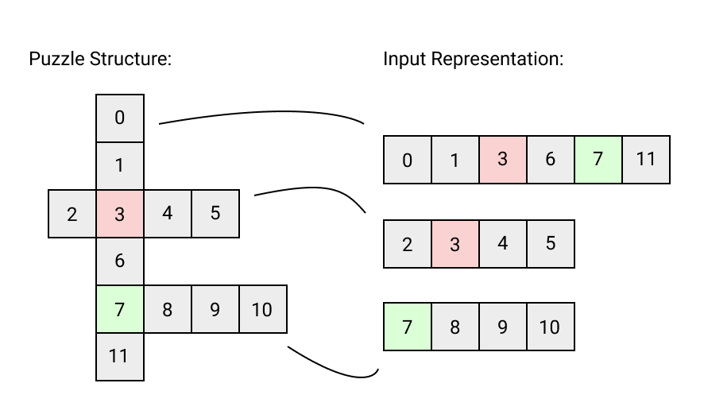
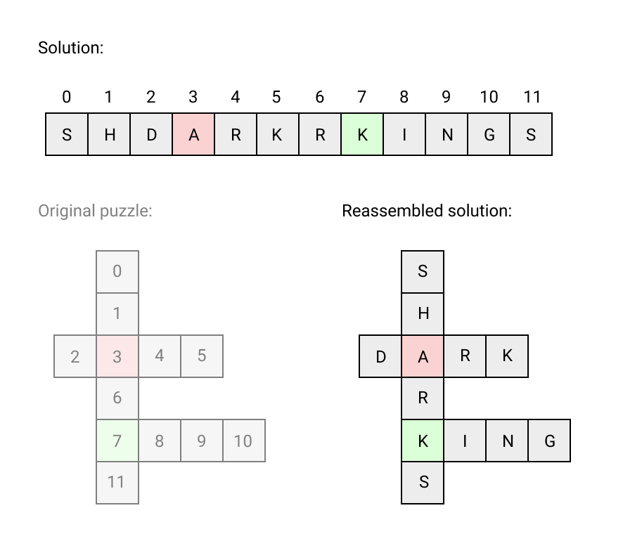

Crossword Composer
==================

Crossword Composer is a browser-based tool for making crossword puzzles. This codebase consists of two main pieces:

- A generic word puzzle auto-filler, which finds a set of words that conform to a given shared-letter constraints. The auto-filler is written in Rust, and could be used as a standalone library. The auto-filler itself is not aware of the structure of the crossword. It is more akin to a SAT solver which takes a problem distilled down to its most basic representation: a list of constraints to be satisfied.
- A browser-based UI which displays a blank crossword and allows the user to put blocks in place to shape the grid. The UI loads a version of the auto-filler compiled to WebAssembly to (try to) fill in the puzzle as the user types.

Auto-filler
-----------

The auto-filler takes two inputs: a dictionary of possible words, and a set of constraints that the solution must satisfy. The constraints are provided as a list of lists, where each inner list represents a word and each entry in it identifies a letter assignment decision that the filler must make. Letters shared by multiple words are indicated by referencing the same letter assignment in the appropriate location.

To better understand, here's one way that a simple crossword puzzle could be turned into an input representation for the solver.

Represented in code, the input representaiton looks like this:

    [
      [0, 1, 3, 6, 7, 11],
      [2, 3, 4, 5],
      [7, 8, 9, 10]
    ]

A valid solution for this particular puzzle, as returned by the solver, could be:

    ['S', 'H', 'D', 'A', 'R', 'K', 'I', 'N', 'G', 'S']

The location of each letter corresponds to the numbers in the puzzle structure diagram above, and can be reassembled into a solution as shown below.

Note that the actual numbers assigned doen't really matter for the purposes of the representation; e.g. if we swap 5 and 7 everywhere they appear we have an equally valid representation of the puzzle.

The filler uses a standard backtracking approach: for each word that needs to be picked, it considers every possible word, subject to the constraints introduced by words already picked. Whenever it reaches a state where no more words exist that satisfy these constraints, it backtracks and reverses prior word selections.

The filler attempts to speed up this process in two ways:

1. It attempts to pick a good order to solve the words in. The basic idea is that when we are on a dead-end route, we want to know as soon as possible that no solution will work so that we can backtrack without wasting time. Note that once we know the order in which we will pick the words, we also know which letters (by position) will be known and which will be unknown by the time we need to fill that word. The heuristic for picking an order is a simple greedy algorithm: first we take the longest word, then we continually take the word with the highest number of letters that overlap with previously picked words (breaking ties by length, preferring the longest).
2. For each step in the backtracking search, an in-memory index is created just for that step. The index provides a fast mapping between possible sets of the letters that will be *known* at a given stage to all of the sets of letters that are *unknown*. One way to think of these indexes is as a sort of permuted dictionary. If you have a regular dictionary, and you want to fill in the blanks in the word `sp___`, it's a fast operation. But if you want to fill in the word `_p__n`, it's slow -- you have to scan the whole dictionary! If you are planning to solve a lot of `_#__#` fill-in-the-blanks, as we are, it is worthwhile to create a whole new dictionary where you permute the words so that the known letters appear at the beginning (for example, in the case mentioned above, `spoon` becomes `pnsoo`). Luckly, once we have pre-determine our order, the blanks for each word *will* always be in the same spot for each word we are trying to solve for! So we create one of these indexes for each of them.

Once those tasks are completed, we begin backtracking. At this point, we can even throw away the dictionary we were given as input, since the indexes we built for each word contain all the vocabulary information we need.

Browser UI
----------

